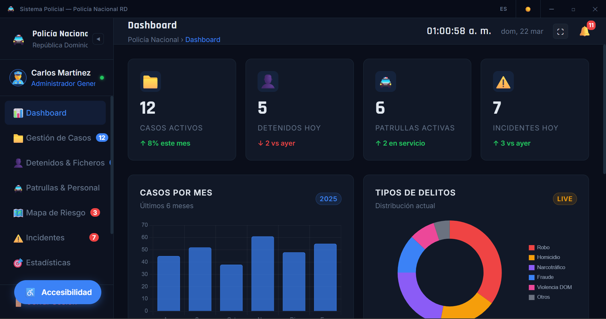

# 🚔 Sistema de Gestión Policial — Policía Nacional RD

> Aplicación de escritorio para la gestión integral de operaciones policiales de la República Dominicana.


---

## 📋 Descripción

Sistema de Gestión Policial es una aplicación de escritorio desarrollada con **Electron.js + HTML + CSS + JavaScript** que permite a los oficiales de la Policía Nacional RD gestionar todas las operaciones desde una sola plataforma. Incluye gestión de casos, detenidos, patrullas, incidentes, chat interno, estadísticas avanzadas y más.

Desarrollado como **proyecto académico de examen final** para la materia de Diseño de Interfaces Gráficas de Usuario.

---

## 🖥️ Capturas de Pantalla

```
Login → Dashboard → Módulos → Chat → Estadísticas
```

---

## ✨ Funcionalidades

### Módulos Principales
| Módulo | Descripción |
|--------|-------------|
| 🔐 **Login** | Autenticación con 4 roles: Administrador, Detective, Oficial, Analista |
| 📊 **Dashboard** | Estadísticas en tiempo real con gráficas interactivas |
| 📁 **Casos** | Registro y seguimiento de casos policiales |
| 👤 **Detenidos** | Ficheros completos con datos personales y estado judicial |
| 🚔 **Patrullas** | Control de unidades activas por zona y turno |
| 🗺️ **Mapa de Riesgo** | Mapa interactivo de zonas por nivel de peligrosidad |
| ⚠️ **Incidentes** | Registro de incidentes con nivel de gravedad |
| 📋 **Reportes** | Generación y exportación de reportes oficiales |
| 📅 **Turnos** | Calendario semanal con 3 vistas de horarios |
| 💬 **Chat** | Mensajería interna entre oficiales y grupos |
| 🎯 **Estadísticas** | Panel avanzado con KPIs, radar, tendencias y más |

### Funcionalidades Extra
- 🔔 **Alertas en tiempo real** — Notificaciones automáticas con sonido
- 🖨️ **Fichas oficiales** — Impresión con formato PNRD
- ♿ **Accesibilidad WCAG 2.1 AA** — Alto contraste, daltonismo, voz
- 🌙 **Modo oscuro/claro** — Guardado en localStorage
- 🌐 **Bilingüe ES/EN** — Traducción completa en tiempo real
- ⌨️ **Atajos de teclado** — Navegación sin mouse

---

## 🛠️ Tecnologías

| Tecnología | Uso |
|------------|-----|
| **Electron.js** | App de escritorio ejecutable (.exe) |
| **HTML5** | Estructura semántica |
| **CSS3** | Diseño, animaciones y temas |
| **JavaScript ES6+** | Lógica de la aplicación |
| **Chart.js** | Gráficas interactivas |
| **Node.js** | Entorno de ejecución |
| **Web Audio API** | Sonidos de alertas |
| **Web Speech API** | Anuncios de voz |

---

## 📁 Estructura del Proyecto

```
sistema-policial-rd/
│
├── main.js                  ← Proceso principal Electron
├── index.html               ← Login + estructura principal
├── package.json             ← Configuración del proyecto
│
├── css/
│   ├── styles.css           ← Estilos principales
│   └── themes.css           ← Modo oscuro y claro
│
├── js/
│   ├── app.js               ← Lógica principal
│   ├── data.js              ← Datos simulados PNRD
│   ├── i18n.js              ← Sistema bilingüe ES/EN
│   ├── accesibilidad.js     ← WCAG 2.1 AA
│   ├── alertas.js           ← Sistema de alertas
│   ├── fichas.js            ← Impresión oficial
│   ├── turnos.js            ← Gestión de turnos
│   ├── chat.js              ← Chat interno
│   └── estadisticas.js      ← Panel de análisis
│
└── modules/
    ├── dashboard.html
    ├── casos.html
    ├── detenidos.html
    ├── patrullas.html
    ├── mapa.html
    ├── incidentes.html
    ├── reportes.html
    ├── turnos.html
    ├── chat.html
    └── estadisticas.html
```

---

## 🚀 Instalación y Uso

### Requisitos
- Node.js v18 o superior
- npm v8 o superior

### Instalación

```bash
# Clonar el repositorio
git clone https://github.com/TuUsuario/sistema-policial-rd.git

# Entrar a la carpeta
cd sistema-policial-rd

# Instalar dependencias
npm install

# Ejecutar la aplicación
npm start
```

### Credenciales de Demo

| Placa | Contraseña | Rol |
|-------|-----------|-----|
| PN-10023 | 1234 | Administrador General |
| PN-20045 | 1234 | Detective / Investigador |
| PN-30067 | 1234 | Oficial de Patrulla |
| PN-40089 | 1234 | Analista de Datos |

> En modo demo cualquier placa con contraseña de 4+ caracteres funciona.

---

## ⌨️ Atajos de Teclado

| Atajo | Acción |
|-------|--------|
| `Alt + A` | Panel de accesibilidad |
| `Alt + D` | Dashboard |
| `Alt + C` | Casos |
| `Alt + P` | Patrullas |
| `Alt + M` | Mapa de riesgo |
| `Alt + I` | Incidentes |
| `Alt + R` | Reportes |
| `Tab` | Navegar entre elementos |
| `Enter` | Activar elemento |
| `Esc` | Cerrar panel / modal |

---

## ♿ Accesibilidad

Esta aplicación cumple con los estándares **WCAG 2.1 AA**:

- ✅ Alto contraste para baja visión
- ✅ 4 filtros de daltonismo (Protanopia, Deuteranopia, Tritanopia, Acromatopsia)
- ✅ 4 tamaños de texto ajustables
- ✅ Reducción de animaciones
- ✅ Cursor grande para motricidad reducida
- ✅ Anuncios de voz con Web Speech API
- ✅ Navegación completa por teclado
- ✅ Etiquetas ARIA en todos los elementos

---

## 👥 Equipo de Desarrollo

| Integrante | Responsabilidad |
|-----------|----------------|
| Rafael | Diseño de interfaces gráficas |
| José Angel | Principios fundamentales de diseño |
| Rosmery | Reglas de oro de Mandel |
| Elisanna | Diseño gráfico de interfaces |
| Andrés | Modelo orientado a objetos |
| Alan | Modelo orientado a eventos |
| Laioneall | Lenguaje de Modelado UML |
| Wilkin | Diseño de software web |
| Juan Pablo | Elementos de interfaz gráfica |
| Kendry | Herramientas de desarrollo |

---

## 📚 Conceptos Académicos Aplicados

- **Diseño de Interfaces** — Layout consistente con sidebar fijo y área de contenido
- **Principios de Usabilidad** — Feedback inmediato, navegación predecible
- **Reglas de Mandel** — Control del usuario, reducción de carga cognitiva
- **Modelo OO** — Objetos casos, detenidos, patrullas en `data.js`
- **Modelo de Eventos** — EventListeners, IPC Electron, MutationObserver
- **UML** — Arquitectura de módulos y flujo de datos
- **Accesibilidad** — WCAG 2.1 AA completo
- **Responsive Design** — Adaptable a diferentes tamaños de ventana

---

## 📄 Licencia

Proyecto académico — Ingeniería en Sistemas © 2025

---

*Desarrollado con dedicación por el ING: Andres Escolastico.*